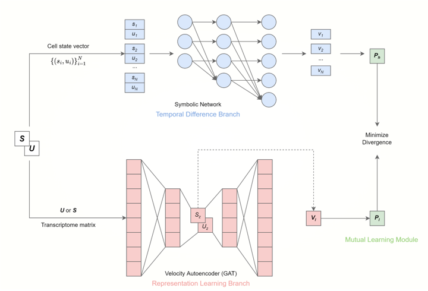

# SymVelo

SymVelo is a a dual-path framework to estimate RNA velocity, which first trains two branches of neural networks for high- and low-dimensional RNA velocities, respectively. The framework then aligns them via mutual learning. It successfully inherits the robustness from representation learning via the low-dimensional branch while preserving biological interpretability through the high-dimensional one. Furthermore, mutual learning covers all cells for each latent dimension, which provides inter-gene information on the supervision of representation learning.

The framework is as follows:



SymVelo consists of three modules, including the temporal difference module, the pre-trained representation learning module and the mutual learning module. 
1. The temporal difference module aims to estimate the continuous high-dimensional RNA velocity via Neural ODE in a bottom-up manner. The main component of this module is a tailored symbolic network [SymNet](https://arxiv.org/abs/1710.09668), which models the transcriptional gene dynamics via the generalized kinetic model. 
2. The representation learning branch aims to learn a low-dimensional representation of RNA velocity to avoid the sparsity and noise of the raw counts, and it has been shown effective to reveal robust cell transitions in [VeloAE](https://www.biorxiv.org/content/10.1101/2021.03.19.436127v1). 
3. We adopt [deep mutual learning (DML)](https://ec.europa.eu/research-and-innovation/en/statistics/policy-support-facility/mutual-learning) to further align the transition probabilities obtained from the two branches.


## Installation

It is recommended to create an environment with [requirement.txt](./doc/requirement.txt), Otherwise you have to be careful when installing packages like ``scvelo`` and ``scipy``. If the code does not work, please check the following versions. 

```
torch                 1.9.0
torch-geometric       2.0.3
scanpy                1.8.2
h5py                  3.6.0
scanpy                1.8.2
sympy                 1.10.1
veloAE                0.0.2 
anndata               0.7.8
numba                 0.55.1
numpy                 1.20.0
```

## Usage

### VeloAE Pre-training

We modified VeloAE to better coordinate with SymNet, the modified VeloAE is in ``VeloAE`` folder. Take the [DentateGyrus dataset](./veloae-dentategyrus.ipynb) as an example, we can get a VeloAE pre-trained model, the velocity graph and metrics (ICVCoh and CBDir) via VeloAe :

```
ipython veloae-dentategyrus.ipynb
```

For other datasets, we only need to adjust the parameters and the data preprocessing method (if any) in the ``.ipynb`` files.
```
# parameters

'--data-dir', './data/DentateGyrus/DentateGyrus.h5ad', # the path of dataset
'--model-name', './pretrain_model/dentategyrus_model.cpt', # the path to save pretrain model


# preprocessing (if any)

adata = scanpy.read_h5ad(args.data_dir)
# your method
scv.pp.neighbors(adata, n_neighbors=30, n_pcs=30)
scv.utils.show_proportions(adata)
scv.pp.filter_and_normalize(adata, min_shared_counts=30, n_top_genes=args.n_raw_gene)
scv.pp.moments(adata, n_pcs=30, n_neighbors=30)
```

### SymNet Training
We redesign the network and coefficient calculation logic so that SymNet can calculate multiple genes at the same time, the modified VeloAE is in ``SymNet`` folder.
We train SymNet and pre-trained VeloAE via DML method in [main.py](main.py). Each important parameters are commented in their respective help, and only a few parameters need to be changed while trainning or velocity calculating, like:

```
pretrain_model, use_bias, epochs_s, lr_s, lr_v, psm, dt, dataset, gumbsoft_tau, psd, frozen, veloae_coef, hidden_layer_s, checkpoint.
```

For scNT-seq dataset, the command is like:

```
python main.py --pretrain_model ./pretrain_model/scNT_model.cpt --use_bias True --epochs_s 10 --lr_v 1e-5 --lr_s 1e-3 --psm random --dt 1  --dataset scNTseq --gumbsoft_tau 5 --psd high --frozen False --batch_size 3000 --checkpoint ./checkpoint/scNTseq/
```
For DentateGyrus dataset, the command is like:

```
python main.py --pretrain_model ./pretrain_model/dentategyrus_model.cpt --use_bias True --epochs_s 450 --lr_v 1e-5 --lr_s 1e-3 --psm random --dt 1  --dataset dentategyrus --gumbsoft_tau 5 --psd high --frozen False --batch_size 3000 --checkpoint ./checkpoint/dentategyrus/
```
For greenleaf multiome dataset, the command is like:

```
python main.py --pretrain_model ./pretrain_model/greenleaf3.cpt --use_bias True --epochs_s 10 --lr_v 5e-7 --lr_s 1e-4 --psm all --dt 10  --dataset Multi --gumbsoft_tau 5 --psd high --frozen False --gene_number 954 --batch_size 4000 --checkpoint ./checkpoint/Multi/
```

If the parameter "forzen" set to True, we frozen VeloAE and train SymNet alone; From line 367 to line 547 and if the parameter "forzen" set to False, we train VeloAE and SymNet together, and adopt DML to further align the transition probabilities obtained from VeloAE and SymNet:
+ First of all, we sample pairs for SymNet training by the velocity calculated by the VeloAE pre-trained model. For cell $i$, cell’s expression state $x \in \mathbb{R}^{M\cdot d}$, the neighbor cells $j \in N(i)$, velocity $v$ and spliced RNAs in latent space $x^z$, we sample $(i, j)$ as a pair if the direction of truthful cellular state change from $i$ to $j$ is close to velocity $v_i$. We set three sampling methods(details in [utils.py](utils.py)): 
    1. random: 90% probability to select $j = \mathop{\arg\max}\\cos\langle v_i, x_j^z - x_i^z \rangle$ and 10% probability to sample a random neighbor cell as $c_j$, which result in pair $(i, j)$.
    2. all: pair each cell with all its neighbors.
    3. randomv2: similar to random method, but sample 5 pairs with top-5 closest cells. 

    Then, we get pairs for each cell and concatenate cell state of each omics to obtain the truthful implied future cell state $x^+$. We update the pairs for several epoch(s) of training(now every epoch) to ensure that the two models can learn from each other and explore the correct velocities.

+ Calculate velocities and loss funtions from SymNet $V_h$ and VeloAE $V_l$:
    1. For cell’s expression state $x$ and the time scale $dt$, $$V_h = \frac{SymNet(x) - x}{dt}.$$
    2. Step loss function is MSE, $$L_{step} = \sum_{(x,x^+)} \left \| \frac{SymNet(x) - x}{dt}\right \|_2^2.$$
    3. Sparse loss function is to constrain the sparsity of the network parameters
    4. VeloAE velocity and loss funcion can refer to its article.

+ Transition probability matrix
    1. Given cell’s expression state $x$ and $V_h$, we can obtain the transition probability matrix $P^s$(details in ``get_state_change_vector`` function of [utils.py](utils.py)).  
    2. For cell $i$ and its neighbor cell $j \in N(i)$, $$P_{i,j}^s = \frac{1}{z_{i}} \exp \left( \cos \langle v_i, x_j - x_i \rangle\right), $$ with $z_i = \sum_{j=1}^N \exp \left( \cos \langle v_i, x_j - x_i \rangle\right)$.  
    3. Similarly, we can calculate the transition probability matrix of VeloAE $P_v$ via the cell’s expression state in latent space $x^z$ via VeloAE's encoder and $V_l$ (both $V_l$ and $x^z$ are low-dimensional).  
    4. We then adopt the symmetric Jensen-Shannon Divergence loss as the mimicry loss.
    5. We have made some optimizations in this part, but the calculation and backpropagation of the divergence loss is still a time bottleneck.

+ Count losses, get and save the coefficients of SymNet, save checkpoint and so on.

### SymNet Results

We can get the velocity graphs and the metrics of SymNet and VeloAE by checkpoint we save in [infer.py](infer.py). Some parameters should be the same as when training.  
For scNT-seq dataset, the command corresponding to the above is:

```
python infer.py --pretrain_model ./pretrain_model/scNT_model.cpt --checkpoint ./checkpoint/scNTseq/odenet_randomhigh_hl2_nb_True_ep_10.pth --psm random --frozen False --dt 1 --use_bias True --dataset scNTseq --gumbsoft_tau 5 --psd high --figures ./figures/scNTseq/
```
